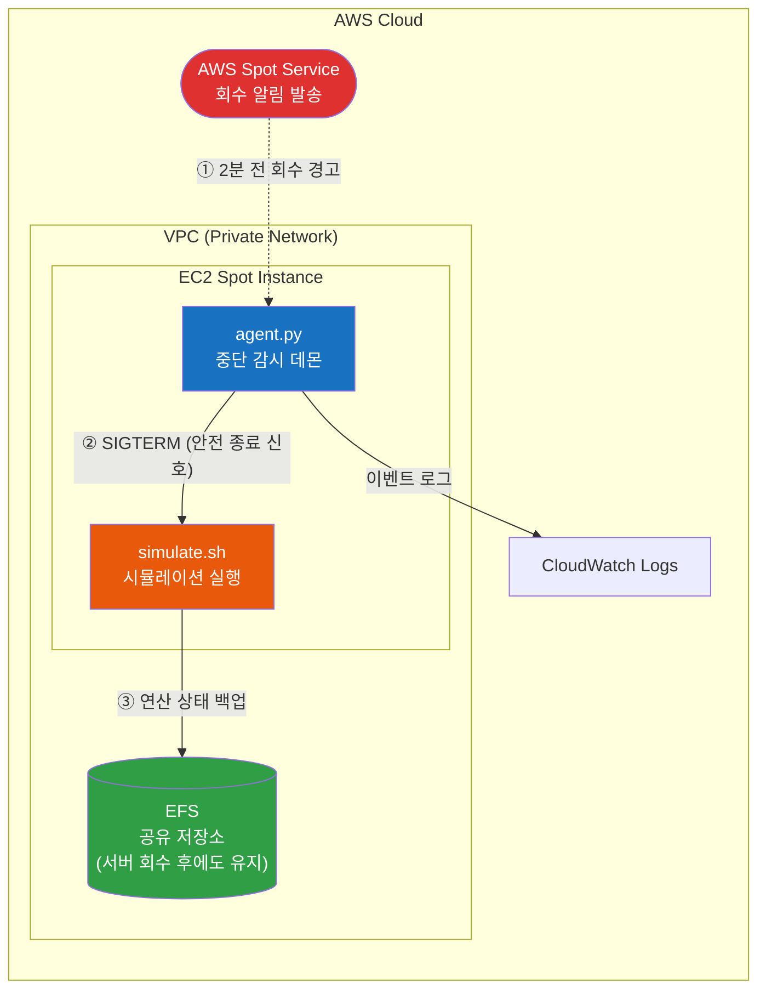

# terraform-spot-eda-hpc-mitigator

> AWS Spot 인스턴스 중단 자동 대응 시스템 — 반도체 EDA/HPC 시뮬레이션 워크로드용

## Overview

반도체 설계(EDA) 시뮬레이션을 AWS Spot 인스턴스에서 운용할 때, 서버 회수(2분 전 사전 경고)를 자동 감지하여 **실행 중인 연산 결과를 네트워크 저장소(EFS)에 안전하게 보존**하는 인프라 자동화 시스템입니다.

### 배경: Spot 인스턴스란?

| 구분       | 일반 서버 (On-Demand) | Spot 인스턴스                           |
| ---------- | --------------------- | --------------------------------------- |
| **비용**   | 정가 100%             | 정가 대비 60~90% 할인                   |
| **가용성** | 항시 유지             | AWS가 **2분 전 경고 후 강제 회수** 가능 |

Spot은 비용 효율이 높지만, 회수 시점에 대비하지 않으면 수시간~수일 분량의 시뮬레이션 결과가 유실됩니다. 이 시스템은 그 2분 내에 상태를 자동 보존합니다.

---

## Architecture



### 처리 흐름

```
AWS 회수 경고 발생 → agent.py 감지 (5초 주기 폴링)
→ simulate.sh에 종료 신호 전송 → 현재 연산 상태를 EFS에 저장
→ 프로세스 정상 종료 → 서버 회수되어도 데이터 무손실
```

---

## Project Structure

```
.
├── main.tf                 # 인프라 정의 (네트워크, 보안, 저장소, 서버)
├── variables.tf            # 배포 설정값 (서버 사양, 리전, 보안 등)
├── outputs.tf              # 배포 결과 출력 (서버 IP, 저장소 ID 등)
├── .gitignore
└── scripts/
    ├── user_data.sh        # 서버 기동 시 자동 실행되는 초기화 스크립트
    ├── agent.py            # Spot 회수 감시 데몬 (IMDSv2 기반)
    └── simulate.sh         # 시뮬레이션 워커 (SIGTERM 수신 시 상태 백업)
```

---

## Quick Start

### Prerequisites

- AWS CLI 인증 설정 완료 (`aws configure`)
- Terraform >= 1.5.0

### Deploy

```bash
git clone https://github.com/YOUR_ACCOUNT/terraform-spot-eda-hpc-mitigator.git
cd terraform-spot-eda-hpc-mitigator

# 환경별 설정 (본인 환경에 맞게 수정)
cat > terraform.tfvars <<EOF
environment       = "dev"
instance_type     = "c5.large"
allowed_ssh_cidrs = ["본인_IP/32"]
key_pair_name     = "본인_키페어_이름"
EOF

terraform init
terraform plan       # 생성될 자원 미리보기
terraform apply      # 인프라 생성 실행
```

### Verify

```bash
terraform output spot_instance_public_ip
terraform output efs_id
```

### Destroy

```bash
terraform destroy    # 모든 자원 삭제 (비용 발생 방지)
```

---

## Variables

| Name                | Default          | Description                                      |
| ------------------- | ---------------- | ------------------------------------------------ |
| `aws_region`        | `ap-northeast-2` | 배포 리전 (서울)                                 |
| `instance_type`     | `c5.large`       | 서버 사양 (2 vCPU / 4GB RAM)                     |
| `project_name`      | `eda-hpc`        | 리소스 네이밍 접두사                             |
| `environment`       | `dev`            | 환경 구분 (`dev` / `staging` / `prod`)           |
| `allowed_ssh_cidrs` | `[]`             | SSH 접근 허용 IP 대역 (미지정 시 SSH 비활성)     |
| `spot_max_price`    | `""`             | Spot 최대 입찰가 (미지정 시 On-Demand 가격 상한) |
| `key_pair_name`     | `""`             | EC2 접속용 SSH Key Pair                          |

---

## Security

| 항목            | 적용 내용                                              |
| --------------- | ------------------------------------------------------ |
| 네트워크 접근   | SSH CIDR 미지정 시 인바운드 규칙 자체 미생성           |
| 메타데이터 보호 | IMDSv2 강제 (`http_tokens = required`)                 |
| 저장소 암호화   | EFS 저장 시 암호화 + 전송 구간 TLS                     |
| 권한 관리       | IAM 최소 권한 (EFS 접근 + CloudWatch 로그 전송만 허용) |
| 보안 그룹       | EFS는 워커 서버로부터의 NFS 트래픽만 수신 허용         |

---

## Production 확장 가이드

본 프로젝트는 **PoC(개념 검증)** 용도입니다. EDA 환경 적용 시 아래 확장이 필요합니다.

### 1) 대용량 산출물 대응 — 주기적 Checkpoint

| 현재 (PoC)                          | Production 확장                               |
| ----------------------------------- | --------------------------------------------- |
| 회수 시점에 전체 상태를 한번에 백업 | 시뮬레이션 중 **N분 간격으로 자동 중간 저장** |
| 소용량 데이터만 2분 내 처리 가능    | 회수 시에는 마지막 중간 저장 이후 증분만 처리 |

### 2) 클러스터 규모 운용 — 스케줄러 연동

수십~수백 대 규모의 HPC 클러스터(LSF / Slurm)에서 운용 시:

- 회수 대상 서버를 스케줄러에서 즉시 Drain 처리
- 해당 작업을 잔여 서버로 자동 재배치, 중간 저장 지점부터 재개
