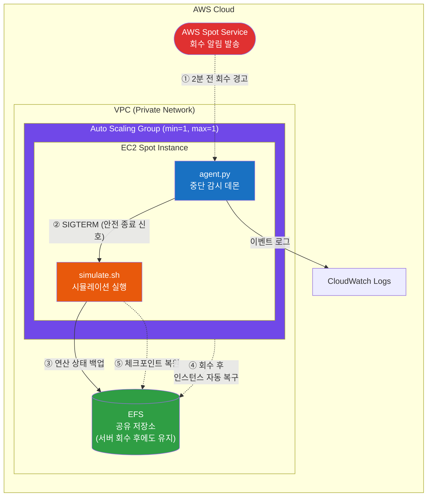

# terraform-spot-eda-hpc-mitigator

> AWS Spot 인스턴스 중단 자동 대응 시스템 — 반도체 EDA/HPC 시뮬레이션 워크로드용

## Overview

반도체 설계(EDA) 시뮬레이션을 AWS Spot 인스턴스에서 운용할 때, 서버 회수(2분 전 사전 경고)를 자동 감지하여 **실행 중인 연산 결과를 네트워크 저장소(EFS)에 안전하게 보존**하는 인프라 자동화 시스템입니다.

### 배경: Spot 인스턴스란?

| 구분       | 일반 서버 (On-Demand) | Spot 인스턴스                           |
| ---------- | --------------------- | --------------------------------------- |
| **비용**   | 정가 100%             | 정가 대비 60~90% 할인                   |
| **가용성** | 항시 유지             | AWS가 **2분 전 경고 후 강제 회수** 가능 |

Spot은 비용 효율이 높지만, 회수 시점에 대비하지 않으면 수시간~수일 분량의 시뮬레이션 결과가 유실됩니다. 이 시스템은 그 2분 내에 상태를 자동 보존합니다.

---

## Architecture



### 처리 흐름

```
AWS 회수 경고 발생 → agent.py 감지 (5초 주기 폴링)
→ simulate.sh에 종료 신호 전송 → 현재 연산 상태를 EFS에 저장
→ 프로세스 정상 종료 → 서버 회수
→ ASG가 새 스팟 인스턴스 자동 생성 (멀티 AZ)
→ simulate.sh가 EFS 백업에서 체크포인트 복원 → 이어서 계산
```

---

## Project Structure

```
.
├── main.tf                 # 인프라 정의 (네트워크, 보안, 저장소, 서버)
├── variables.tf            # 배포 설정값 (서버 사양, 리전, 보안 등)
├── outputs.tf              # 배포 결과 출력 (서버 IP, 저장소 ID 등)
├── .gitignore
└── scripts/
    ├── user_data.sh        # 서버 기동 시 자동 실행되는 초기화 스크립트
    ├── agent.py            # Spot 회수 감시 데몬 (IMDSv2 기반)
    ├── simulate.sh         # 시뮬레이션 워커 (SIGTERM 수신 시 상태 백업)
    └── manual_drain.sh     # 수동 드레인 테스트 (백업 파이프라인 E2E 검증)
```

---

## Quick Start

### Prerequisites

- AWS CLI 인증 설정 완료 (`aws configure`)
- Terraform >= 1.5.0

### Deploy

```bash
git clone https://github.com/YOUR_ACCOUNT/terraform-spot-eda-hpc-mitigator.git
cd terraform-spot-eda-hpc-mitigator

# 환경별 설정 (본인 환경에 맞게 수정)
cat > terraform.tfvars <<EOF
environment       = "dev"
instance_type     = "c5.large"
allowed_ssh_cidrs = ["본인_IP/32"]
key_pair_name     = "본인_키페어_이름"
EOF

terraform init
terraform plan       # 생성될 자원 미리보기
terraform apply      # 인프라 생성 실행
```

### Verify

```bash
terraform output asg_name
terraform output efs_id
terraform output subnet_azs

# 현재 실행 중인 인스턴스 IP 확인 (ASG가 관리하므로 AWS CLI로 조회)
aws ec2 describe-instances \
  --filters "Name=tag:Name,Values=$(terraform output -raw asg_name | sed 's/-asg/-spot-worker/')" \
            "Name=instance-state-name,Values=running" \
  --query 'Reservations[].Instances[].PublicIpAddress' --output text
```

### Destroy

```bash
terraform destroy    # 모든 자원 삭제 (비용 발생 방지)
```

---

## Manual Drain Test

`manual_drain.sh`를 사용하면 **실제 Spot 회수 없이** 드레인 → 백업 파이프라인을 수동으로 검증할 수 있습니다.

### 스크립트 옵션

| 옵션                | 설명                                       |
| ------------------- | ------------------------------------------ |
| `-d, --dry-run`     | 실제 SIGTERM 없이 프리플라이트 체크만 수행 |
| `-t, --timeout SEC` | 드레인 대기 시간 (기본: 30초)              |
| `-r, --restart`     | 드레인 후 simulate.sh를 자동 재시작        |
| `-f, --force`       | 확인 프롬프트 건너뛰기 (CI/자동화용)       |
| `-h, --help`        | 도움말                                     |

### 검증 절차

**1) 인스턴스 접속**

```bash
# ASG 인스턴스의 퍼블릭 IP 조회 후 접속
INSTANCE_IP=$(aws ec2 describe-instances \
  --filters "Name=tag:Name,Values=eda-hpc-dev-spot-worker" \
            "Name=instance-state-name,Values=running" \
  --query 'Reservations[].Instances[].PublicIpAddress' --output text)

ssh -i ~/.ssh/YOUR_KEY.pem ec2-user@$INSTANCE_IP
```

**2) 프리플라이트 체크 (Dry Run)**

SIGTERM을 보내기 전에 프로세스·EFS·백업 디렉토리 상태를 먼저 확인합니다.

```bash
sudo bash /opt/eda-hpc/manual_drain.sh --dry-run
```

정상 출력 예시:

```
▶ Phase 0 — Pre-flight Checks
[OK]    PID 파일 존재 (/opt/eda-hpc/simulate.pid)
[OK]    프로세스 활성 (PID 1234)
[OK]    백업 디렉토리 쓰기 가능 (/mnt/efs/backup)
[OK]    EFS 마운트 (/mnt/efs)
[INFO]  프리플라이트: 4/4 통과
[INFO]  드라이런 모드 — 실제 드레인을 수행하지 않습니다.
```

**3) 수동 드레인 실행**

```bash
sudo bash /opt/eda-hpc/manual_drain.sh
```

실행하면 현재 시뮬레이션 상태를 보여준 뒤 확인을 요청합니다. `y`를 입력하면 SIGTERM → 종료 대기 → 백업 검증이 순서대로 진행됩니다.

**4) 드레인 + 자동 재시작 (연속 테스트용)**

```bash
sudo bash /opt/eda-hpc/manual_drain.sh --restart --force
```

드레인 후 simulate.sh를 자동으로 다시 기동하므로, 반복 테스트 시 유용합니다.

### 검증 항목

| 단계    | 확인 내용                                     | PASS 기준                  |
| ------- | --------------------------------------------- | -------------------------- |
| Phase 0 | PID 파일, 프로세스, 백업 디렉토리, EFS 마운트 | 전체 통과                  |
| Phase 1 | 현재 시뮬레이션 상태 확인 + 사용자 승인       | `y` 입력 (--force 시 스킵) |
| Phase 2 | SIGTERM 전송 후 프로세스 종료                 | DRAIN_TIMEOUT 내 종료      |
| Phase 3 | `/mnt/efs/backup/` 에 새 백업 파일 생성       | 파일 수 증가 + 내용 정상   |
| Phase 4 | (--restart 시) simulate.sh 재기동             | 새 PID로 프로세스 활성     |

---

## 자동 복구 & 체크포인트

### 스팟 회수 후 자동 복구 (ASG)

Auto Scaling Group이 인스턴스를 항상 1대 유지합니다. 회수되면 멀티 AZ 중 스팟 용량이 있는 곳에서 자동으로 새 인스턴스가 올라옵니다.

```
회수 전: ap-northeast-2a에서 실행 중
    ↓ (스팟 회수)
회수 후: ASG가 2a / 2b / 2c 중 가용한 AZ에서 자동 생성
    ↓
새 인스턴스: EFS 마운트 → 체크포인트 복원 → 시뮬레이션 재개
```

### 체크포인트 복원 (simulate.sh)

`simulate.sh`는 시작 시 `/mnt/efs/backup/`에서 가장 최근 백업 파일을 찾아 `current_number`와 `current_sum`을 복원합니다. 복원할 백업이 없으면 처음부터 시작합니다.

```
[2026-07-12 18:00:01] [RESTORE] 체크포인트 복원 완료: num=5400001 sum=14580002700000 (from: progress_20260712_175823.txt)
[2026-07-12 18:00:01] [START] 시뮬레이션 시작 (PID: 1234, num=5400001, sum=14580002700000)
```

---

## Production 확장 가이드

본 프로젝트는 **PoC(개념 검증)** 용도입니다. EDA 환경 적용 시 아래 확장이 필요합니다.

### 1) 대용량 산출물 대응 — 주기적 Checkpoint

| 현재 (PoC)                          | Production 확장                               |
| ----------------------------------- | --------------------------------------------- |
| 회수 시점에 전체 상태를 한번에 백업 | 시뮬레이션 중 **N분 간격으로 자동 중간 저장** |
| 소용량 데이터만 2분 내 처리 가능    | 회수 시에는 마지막 중간 저장 이후 증분만 처리 |

### 2) 클러스터 규모 운용 — 스케줄러 연동

수십~수백 대 규모의 HPC 클러스터(LSF / Slurm)에서 운용 시:

- 회수 대상 서버를 스케줄러에서 즉시 Drain 처리
- 해당 작업을 잔여 서버로 자동 재배치, 중간 저장 지점부터 재개
